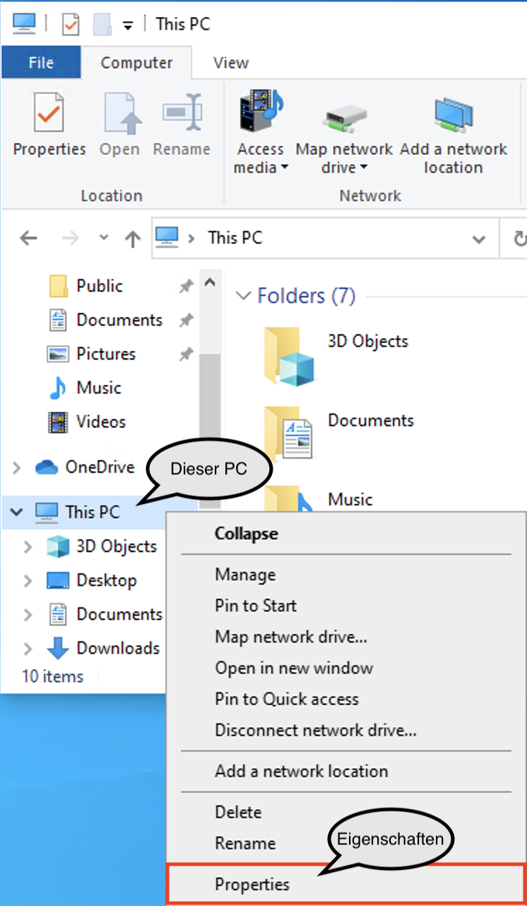

# Arrays (Listen) am Beispiel "Suchen und Ordnen"

Hier lernen Sie, Daten strukturiert in Arrays (in Python: Listen) zu speichern und üben den Umgang damit am Beispiel von Such- und Sortieralgorithmen.

## Inhalt

Nach einer Einführung in Jupyter Notebooks und Markdown anhand einer Auffrischung des vorausgesetzten Programmierwissens erfolgt eine  Einführung in Arrays (Listen).

Im Teil Suchen und Ordnen (Sortieren) werden verschiedene Such- und Sortieralgorithmen vertieft. Jeder Algorithmus erlaubt es Ihnen, sich konkret mit Listenoperationen zu befassen.

* **Vorbereitende Inhalte**
  * Einführung in Markdown und Auffrischung des Programmierkönnens (Aktivierung des Vorwissens)
  * Einführung in Fehlermeldungen
  * Material:  
  Jupyter Notebook: Erste-Schritte.ipynb  
    * Zur lokalen Bearbeitung (Download): [Notebook](assets/notebooks/Erste-Schritte.ipynb) [Lösungen](assets/notebooks/Erste-Schritte-Loesungen.ipynb)
    * Zur Bearbeitung auf Google Colaboration [Notebook](https://colab.research.google.com/github/donze-informatikunterricht/suchen-und-ordnen/blob/gh-pages/assets/notebooks/Erste-Schritte.ipynb) [Lösungen](https://colab.research.google.com/github/donze-informatikunterricht/suchen-und-ordnen/blob/gh-pages/assets/notebooks/solutions/Erste-Schritte-Loesungen.ipynb)
* **Arrays** (in Python: Listen) als Sammelgefäss von Daten
  * Erstellen von Listen
  * Iteration über Listen
  * Zugriff auf Listenbereiche
  * Material:  
   Jupyter Notebook: Arrays.ipynb  
    * Zur lokalen Bearbeitung (Download) [Notebook](assets/notebooks/Arrays.ipynb) [Lösungen](assets/notebooks/Arrays-Loesungen.ipynb)
    * Zur Bearbeitung auf Google Colaboration [Notebook](https://colab.research.google.com/github/donze-informatikunterricht/suchen-und-ordnen/blob/gh-pages/assets/notebooks/Arrays.ipynb) [Lösungen](https://colab.research.google.com/github/donze-informatikunterricht/suchen-und-ordnen/blob/gh-pages/assets/notebooks/solutions/Arrays-Loesungen.ipynb)
  * Zusatzmaterial zu Zufallszahlen:  
   Jupyter Notebook: Zufallszahlen.ipynb  
    * Zur lokalen Bearbeitung (Download): [Notebook](assets/notebooks/Zufallszahlen.ipynb) [Lösungen](assets/notebooks/Zufallszahlen-Loesungen.ipynb)
    * Zur Bearbeitung auf Google Colaboration [Notebook](https://colab.research.google.com/github/donze-informatikunterricht/suchen-und-ordnen/blob/gh-pages/assets/notebooks/Zufallszahlen.ipynb) [Lösungen](https://colab.research.google.com/github/donze-informatikunterricht/suchen-und-ordnen/blob/gh-pages/assets/notebooks/solutions/Zufallszahlen-Loesungen.ipynb)
* **Algorithmen zum Suchen und Ordnen**  
  * Einführung in Algorithmen
       Der folgende Clip der Exact Instructions Challenge von Josh Darnit auf YouTube (keine deutschen Untertitel verfügbar) zeigt auf, worauf Sie achten müssen, wenn Sie Algorithmen beschreiben.  
       

    * Material:  
      Jupyter Notebook: Algorithmen.ipynb  
    * Zur lokalen Bearbeitung (Download): [Notebook](assets/notebooks/Algorithmen.ipynb) [Lösungen](assets/notebooks/Algorithmen-Loesungen.ipynb)
    * Zur Bearbeitung auf Google Colaboration [Notebook](https://colab.research.google.com/github/donze-informatikunterricht/suchen-und-ordnen/blob/gh-pages/assets/notebooks/Algorithmen.ipynb) [Lösungen](https://colab.research.google.com/github/donze-informatikunterricht/suchen-und-ordnen/blob/gh-pages/assets/notebooks/solutions/Algorithmen-Loesungen.ipynb)

  * Einführung ins Thema **Suchen**
    * Suche nach einem Element in einer
      * ungeordneten Liste
      * geordneten Liste
      * Material:  
      Jupyter Notebook: Suchen.ipynb  
    * Zur lokalen Bearbeitung (Download): [Notebook](assets/notebooks/Suchen.ipynb) [Lösungen](assets/notebooks/Suchen-Loesungen.ipynb)
    * Zur Bearbeitung auf Google Colaboration [Notebook](https://colab.research.google.com/github/donze-informatikunterricht/suchen-und-ordnen/blob/gh-pages/assets/notebooks/Suchen.ipynb) [Lösungen](https://colab.research.google.com/github/donze-informatikunterricht/suchen-und-ordnen/blob/gh-pages/assets/notebooks/solutions/Suchen-Loesungen.ipynb)

  * **Sortieren** von Listen nach verschiedenen Algorithmen  
    Als Einführung können Sie sich den folgenden Clip auf YouTube ansehen (deutsche Untertitel verfügbar).  
   
    * Insertion Sort
      * Einfügen eines Elements in eine Liste
      * Material:  
      Jupyter Notebook: Insertionsort.ipynb  
    * Zur lokalen Bearbeitung (Download): [Notebook](assets/notebooks/Insertionsort.ipynb) [Lösungen](assets/notebooks/Insertionsort-Loesungen.ipynb)
    * Zur Bearbeitung auf Google Colaboration [Notebook](https://colab.research.google.com/github/donze-informatikunterricht/suchen-und-ordnen/blob/gh-pages/assets/notebooks/Insertionsort.ipynb) [Lösungen](https://colab.research.google.com/github/donze-informatikunterricht/suchen-und-ordnen/blob/gh-pages/assets/notebooks/solutions/Insertionsort-Loesungen.ipynb)
    * Selection Sort
      * Suche nach dem kleinsten bzw. grössten Element einer Liste
      * Material:  
      Jupyter Notebook: Selectionsort.ipynb  
    * Zur lokalen Bearbeitung (Download): [Notebook](assets/notebooks/Selectionsort.ipynb) [Lösungen](assets/notebooks/Selectionsort-Loesungen.ipynb)
    * Zur Bearbeitung auf Google Colaboration [Notebook](https://colab.research.google.com/github/donze-informatikunterricht/suchen-und-ordnen/blob/gh-pages/assets/notebooks/Selectionsort.ipynb) [Lösungen](https://colab.research.google.com/github/donze-informatikunterricht/suchen-und-ordnen/blob/gh-pages/assets/notebooks/solutions/Selectionsort-Loesungen.ipynb)
    * Bubble Sort
      * Vertausch zweier Listenelemente
      * Sinn der Optimierung von Algorithmen
      * Material:  
      Jupyter Notebook: Bubblesort.ipynb  
    * Zur lokalen Bearbeitung (Download): [Notebook](assets/notebooks/Bubblesort.ipynb) [Lösungen](assets/notebooks/Bubblesort-Loesungen.ipynb)
    * Zur Bearbeitung auf Google Colaboration [Notebook](https://colab.research.google.com/github/donze-informatikunterricht/suchen-und-ordnen/blob/gh-pages/assets/notebooks/Bubblesort.ipynb) [Lösungen](https://colab.research.google.com/github/donze-informatikunterricht/suchen-und-ordnen/blob/gh-pages/assets/notebooks/solutions/Bubblesort-Loesungen.ipynb)
    * Merge Sort
      * Zusammenfügen (Merge) zweier sortierter Listen

## Voraussetzungen

### Programmierkenntnisse

Dieser Kurs nutzt die Programmiersprache Python. Folgende Kenntnisse werden vorausgesetzt:

* Arithmetische Operatoren (`+`, `-`, `*`, `/`, `//`, `%`, `**`)
* Variablen
  * Ein- und Ausgabe mit den Funktionen `input()` und `print()`
  * Verändern von Variablen (`=`, `+=`, `-=`, `*=`, `/=`)
* Datentypen
  * Strings (Zeichenketten)
  * Integer (Ganzzahlen)
  * Float (Fliesskommazahlen)
  * Booleans (Wahrheitswerte)
* Kontrollstrukturen
  * Verzweigungen 
    * einseitig (`if`)
    * zweiseitig (`if` - `else`)
    * mehrstufig (`if` - `elif` - `else`)
    * Logische Ausdrücke mittels
      * relationaler Operatoren (`>`, `<`, `==`, `!=`, `>=`, `<=`)
      * logischer Operatoren (`and`, `or`, `not`)
  * Schleifen
    * zählergesteuert (`for`-Schleifen)
    * kopfgesteuert (`while`-chleifen)
* Funktionen

### Tools

Dieser Kurs verwendet Jupyter Notebooks. Sie können sich diese als interaktive Notizbücher vorstellen, die im Web Browser laufen. Sie machen es möglich, Dokumentation und ausführbaren Code zu verbinden. Falls Sie mehr dazu wissen möchten, ist der Wikipedia-Artikel eine empfehlenswerte Quelle.

Sie können diese lokal auf Ihrem Gerät oder online auf Google Colaboration (dafür ist ein Google-Account nötig) nutzen. Die Jupyter Notebooks werden im Web Browser dargestellt. Sie benötigen also auch einen Web Browser wie Chrome, Safari, Firefox, etc.

Falls Sie auf Ihrem eigenen Gerät arbeiten möchten und Jupyter Notebooks noch nicht installiert haben, geht dies am einfachsten über Anaconda.

#### Installation von Anaconda

1. Anaconda herunterladen

   Sie können Anaconda <a href="https://www.anaconda.com/products/individual" target="_blank">hier herunterladen</a>.  
   <ul>
      <li>Die Individual-Lizenz ist für den Privat- und Ausbildungsbereich kostenlos.</li>
      <li>Ein Klick auf den Button "Download" unter dem obersten Abschnitt scrollt die Seite an den richtigen Ort.</li>
      <li>Wählen Sie das Download-File, das zu Ihrer Umgebung passt.
         <ul>
            <li>Für den <strong>Mac</strong> empfiehlt sich der graphische Installer.</li>
            <li><strong>Windows</strong>: Wenn Sie nicht sicher sind, ob Sie einen 32-bit- oder 64-bit-Prozessor haben: 
                öffnen Sie ein Explorerfenster, Recktsklich auf "Die §ser PC" > Eigenschaften > Systemtyp.
               
            
            </li>
         </ul>
      </li>
   </ul>

   
2. Anaconda installieren

   Folgen Sie den Instruktionen des Installers.  
   <ul>
      <li>Die entsprechenden Konfigurationen sollten bereits vorangewählt sein:
         <ul>
            <li>Install for: `Just me / Nur für mich installieren`</li>
            <li>Destination Folder (Pfad): 
               <strong>Windows</strong>: `C:\users\IhrBenutzername\anaconda3`</li>
         </ul>
      </li>
      <li>Add Anaconda3 to my PATH environment variable</li>
      <li>Register Anaconda3 as my default Python 3.8: <it>Kein Haken</it> ist empfehlenswert, falls Sie noch andere Pythonprojekte mit anderen Tools verwenden.</li>
   </ul>

   
3. Jupyter Notebook öffnen

   Es gibt verschiedene Möglichkeiten, wie Sie Jupyter Notebook starten können.
   <ul>
      <li>Am einfachsten starten Sie Jupyter über das Programm <it>Anaconda Navigator</it>. 
         Öffnen Sie das Programm <it>Anaconda Navigator</it>.
         <ul>
            <li><strong>Mac</strong>: 
               Sie finden es am einfachsten über die Spotlight-Suche mit [⌘ + Leertaste].</li>
            <li><strong>Windows</strong>: 
               Sie finden es über den Startknopf bei den Programmen unter A: Anaconda. 
               
            </li>
         </ul>
      </li>
      <li>Im <strong>Anaconda Navigator</strong> finden Sie Jupyter und andere Tools. 
         
         <ul>   
            <li>Starten Sie Jupyter über den Button "Launch".</li>
            <li>In Ihrem Standard-Web-Browser sollte sich nun Jupyter öffnen.</li>
         </ul>
      </li>
      <li><strong>Windows</strong>: Jupyter Notebook direkt aus dem Start-Menü starten 
         Der Webbrowser wird sich selbst öffnen. 
      </li>
   </ul>

   
4. Möglichkeiten, das Jupyter Notebook im gewünschten Verzeichnis öffnen

   Sie haben die Möglichkeit, Ihr Jupyter Notebook direkt im Verzeichnis Ihrer Wahl zu öffnen.
   <ul>
      <li><strong>Mac</strong>: 
         <ul>
            <li>Öffnen Sie das Terminal und gehen Sie direkt ins Verzeichnis Ihrer Wahl 
               `cd ~/schule/informatik/jupyter`</li>
            <li>Starten Sie das Jupyter Notebook mit dem Befehl 
               `jupyter notebook`</li>
         </ul>
      </li>
      <li><strong>Windows</strong>:
         <ul>
            <li>In diesem Beispiel ist das Verzeichnis: `C:\Users\User\Jupyter` 
               (Benutzername: "User")</li>
            <li>Machen Sie einen Shortcut des Jupyter Launchers auf den auf dem Desktop.
               <ul>
                  <li>Rechtsklick darauf -> Properties</li>
                  <li>Nun können Sie in den Feldern Target bzw. Start in `%USERPROFILE%` bzw. `%HOMEPATH%` durch Ihren Pfad ersetzen: 
                     
                  </li>
               </ul>
            </li>
         </ul>
      </li>
   </ul>

  

### Lizenz

<a property="dct:title" rel="cc:attributionURL" href="https://donze-informatikunterricht.github.io/suchen-und-ordnen/">Suchen und Ordnen</a> by Alessandra Donzé is licensed under <a href="http://creativecommons.org/licenses/by-nc/4.0/?ref=chooser-v1" target="_blank" rel="license noopener noreferrer" style="display:inline-block;">CC BY-NC 4.0 </a>