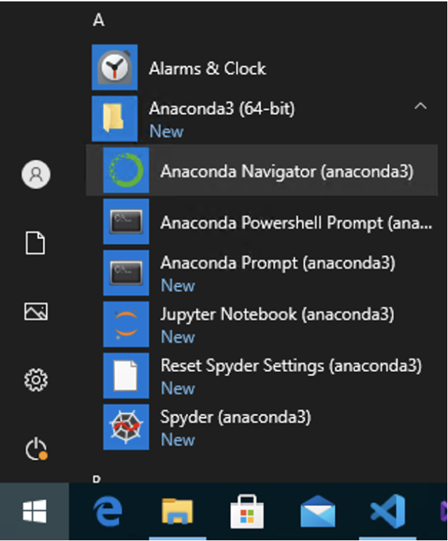
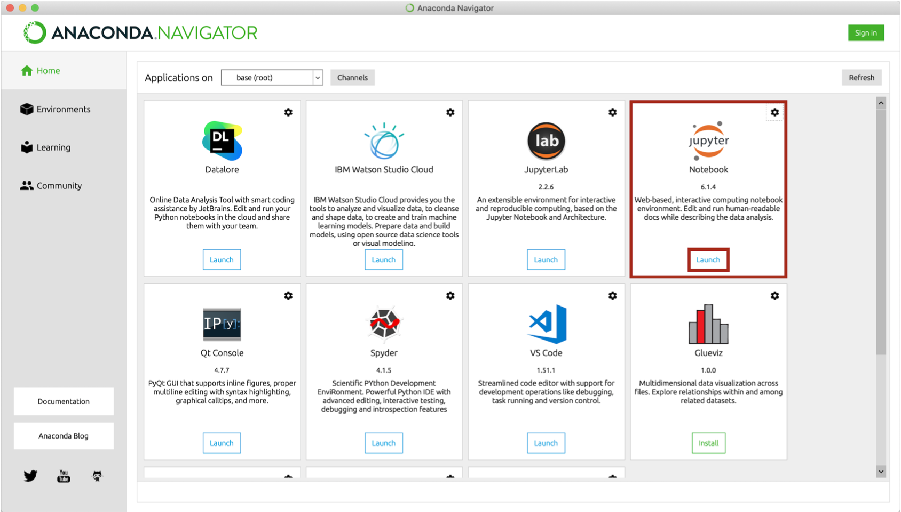

## Installation von Anaconda
    
1. Anaconda herunterladen  
  Sie können Anaconda [hier herunterladen](https://www.anaconda.com/products/individual)  
  * Die Individual-Lizenz ist für den Privat- und Ausbildungsbereich kostenlos. 
  * Der Link "Download" scrollt die Seite nach unten.
  * Wählen Sie das Download-File, das zu Ihrer Umgebung passt.  
    Für den **Mac** empfiehlt sich der graphische Installer.

2. Anaconda installieren  
  Folgen Sie den Instruktionen des Installers.  
  * Die entsprechenden Konfigurationen sollten bereits vorangewählt sein:
    * Install for: `Just me / Nur für mich installieren`
    * Destination Folder (Pfad):  
      **Windows**: `C:\users\IhrBenutzername\anaconda3`
  * Add Anaconda3 to my PATH environment variable
  * Register Anaconda3 as my default Python 3.8: *Kein Haken* ist sicherer, falls Sie noch andere Pythonprojekte mit anderen Tools verwenden.

3. Jupyter Notebook öffnen  
   Es gibt verschiedene Möglichkeiten, wie Sie Jupyter Notebook starten können:
   1. Jupyter über das Programm *Anaconda Navigator* öffnen
      Sie finden es am einfachsten so:
      * **Mac**: Öffnen Sie *Anaconda Navogator*  
        (Sie finden es am einfachsten über die Spotlight-Suche mit \[ ⌘ + Leertaste \] )  
        **Windows**: Öffnen Sie das Programm Anaconda Navigator  
        (über den Startknopf, unter A: Anaconda)
        
                
      * Im Anaconda Navigator finden Sie Jupyter und andere Tools.
      
        
      
        * Starten Sie Jupyter über den Button "Launch".  
        * In Ihrem Standard-Web-Browser sollte sich nun Jupyter öffnen.
    2. **Windows**: Jupyter Notebook direkt aus dem Start-Menü starten  
      * Unter Windows können Sie alternativ dazu ein Jupyter Notebook direkt aus dem Startmenü heraus starten, woraufhin sich der Webbrowser selbst öffnen wird.  
      

4. Möglichkeiten, das Jupyter Notebook im gewünschten Verzeichnis öffnen
   Sie haben die Möglichkeit, Ihr Jupyter Notebook zu öffnen.
   * **Mac**:  
     * Öffnen Sie das Terminal und gehen Sie direkt ins Verzeichnis Ihrer Wahl
       `cd ~/schule/informatik/jupyter`
     * Starten Sie das Jupyter Notebook mit dem Befehl
       `jupyter notebook`
   * **Windows**:  
     * Mein Verzeichnis ist: `C:\Users\User\Jupyter`
     * Machen Sie einen Shortcut des Jupiter Launchers auf den auf dem Desktop.  
        * Rechtsklick darauf -> Properties  
        * Nun können Sie in den Feldern Target bzw. Start in `%USERPROFILE%` bzw. `%HOMEPATH%` durch Ihren Pfad ersetzen:
        
 

