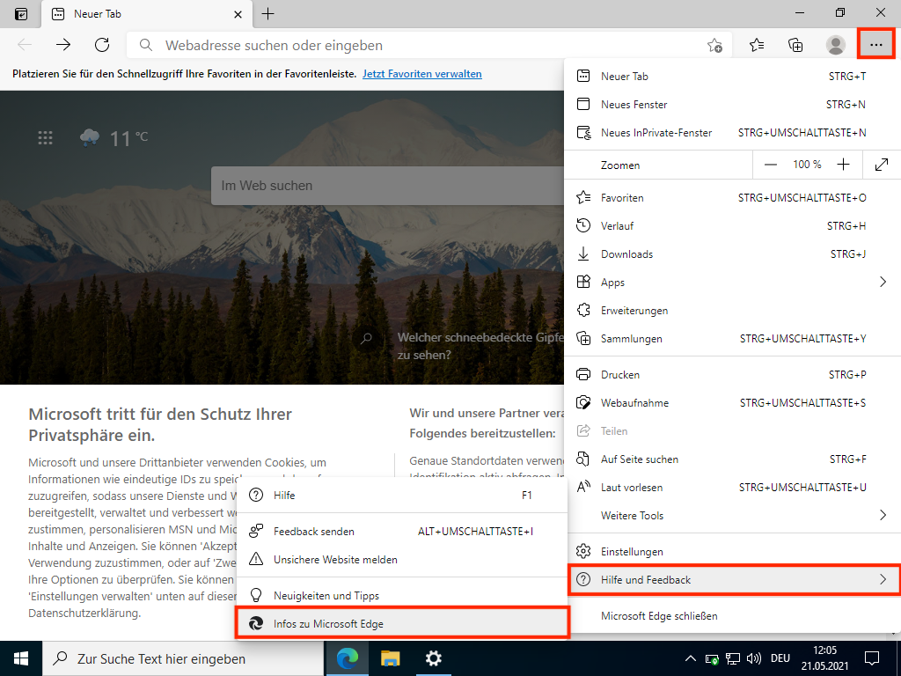
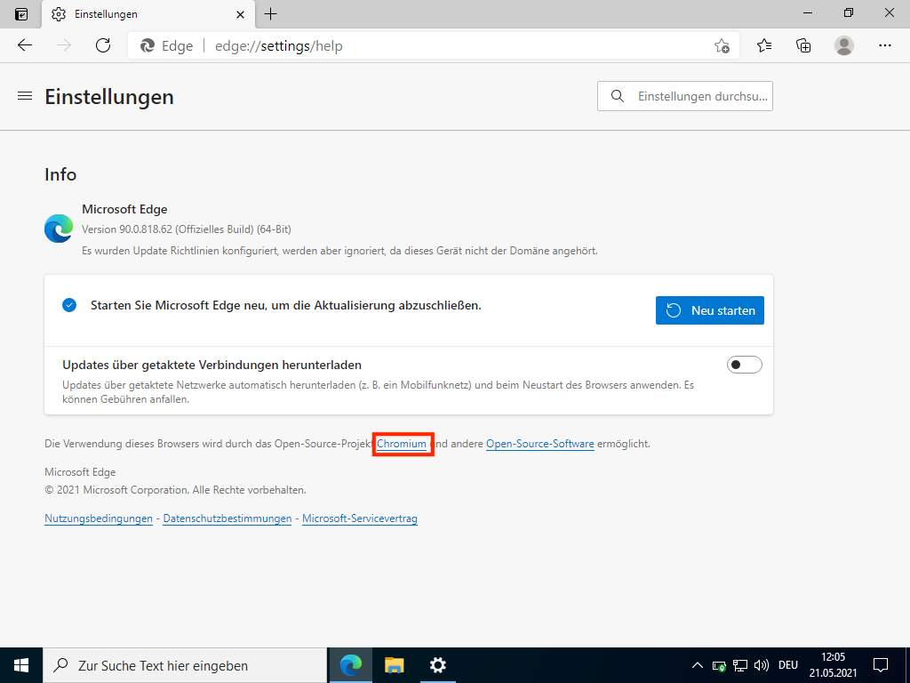

[Startseite](./index.md) | [Lernmaterialien](./kurs.md) | Voraussetzungen | [Installation](./installation_anaconda.md)

## Voraussetzungen

Dieser Kurs erfordert Grundkenntnisse im Programmieren. Sie können diese wenn nötig im ersten Teil des [Kurses](./kurs.md) unter Erste Schritte auffrischen oder einen Einstieg in die Programmierung mit Python finden, falls Sie bereits über Programmierkenntnisse in einer anderen Sprache verfügen.

Kenntnisse über Arrays als sequentielle Datenstruktur sind nicht vorausgesetzt. Diese werden Sie in diesem Kurs erarbeiten und vertiefen.

Die einzelnen Algorithmen lassen sich auch unabhängig voneinander bearbeiten.

Zudem steht Ihnen ein [Python-Cheatsheet (PDF)](assets/notebooks/downloads/cheatsheet.pdf) zur Verfügung.

### Programmierkenntnisse

Dieser Kurs nutzt die Programmiersprache **Python** und setzt die folgenden Kenntnisse voraus:

* Arithmetische Operatoren (`+`, `-`, `*`, `/`, `//`, `%`, `**`)
* Variablen
  * Ein- und Ausgabe mit den Funktionen `input()` und `print()`
  * Verändern von Variablen (`=`, `+=`, `-=`, `*=`, `/=`)
* Datentypen
  * Strings (Zeichenketten)
  * Integer (Ganzzahlen)
  * Float (Fliesskommazahlen)
  * Booleans (Wahrheitswerte)
* Kontrollstrukturen
  * Verzweigungen
    * einseitig (`if`)
    * zweiseitig (`if` - `else`)
    * mehrstufig (`if` - `elif` - `else`)
    * Logische Ausdrücke mittels
      * relationaler Operatoren (`>`, `<`, `==`, `!=`, `>=`, `<=`)
      * logischer Operatoren (`and`, `or`, `not`)
  * Schleifen
    * zählergesteuert (`for`-Schleifen)
    * kopfgesteuert (`while`-Schleifen)
* Funktionen

### Tools

Dieser Kurs basiert auf Jupyter Notebooks. Sie können diese **lokal auf Ihrem Gerät** verwenden oder **online über Google Colaboration**.

Sie benötigen Folgendes:

* lokal und online:
  * einen **modernen Web-Browser**  
  Chrome, Safari, Firefox  
  Edge: den *neuen, Chromium-basierten* Edge. Er ist in Windows noch nicht Standard und muss explizit installiert werden. Um herauszufinden, welchen Edge Sie haben, öffnen Sie Edge. Im [...]-Menü > Hilfe und Feedback > Infos zu Microsoft Edge sehen Sie, wenn Sie einen Chromium-basierten Edge verwenden:  
  |  |  |

**Zur *lokalen Verwendung* benötigen Sie**:

* Jupyter Notebooks (am einfachsten zu installieren über Anaconda, [Installationsanleitung](./installation_anaconda.md)
* beachten Sie, dass Sie in Ihrem Arbeitsverzeichnis die Notebookdateien (.ipynb) und ein Verzeichnis `bilder` haben sollten, das die Bilder enthält.  
  Am einfachsten laden Sie gleich [hier](./suchen-und-ordnen.zip) alle benötigten Dateien herunter und legen es nach dem Entpacken so ab, dass Sie es finden, zum Beispiel in Ihrem Verzeichnis für den Informatikunterricht.

**Zur *Verwendung auf Google Colaboration* benötigen Sie**:

* einen persönlichen Googleaccount.